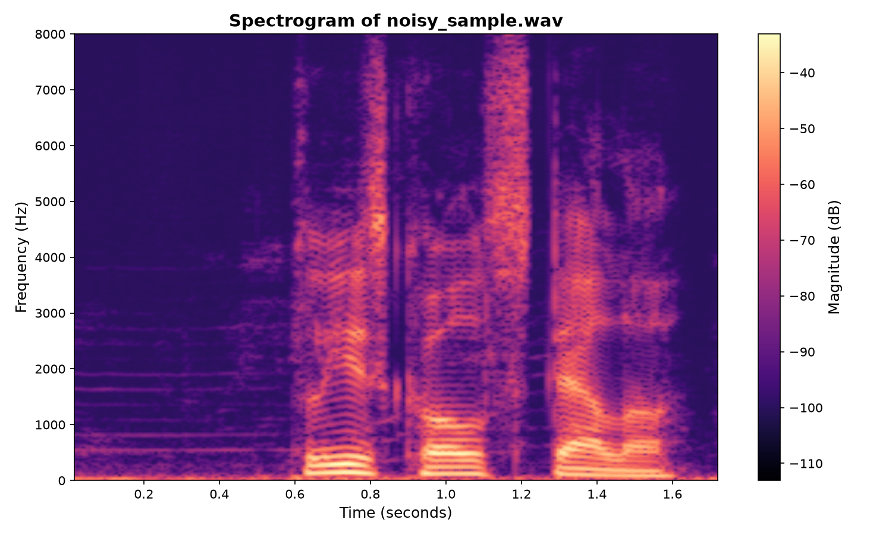
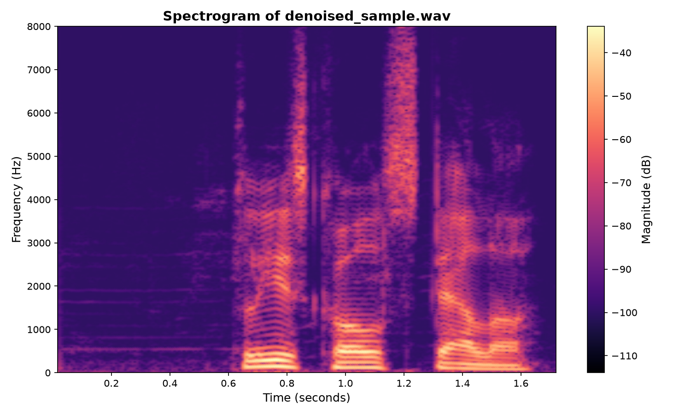

# rt-denoiser — Real-Time Neural Noise Suppression (PyTorch → ONNX → C++)

[](https://github.com/ph0123/Real-time-ML-Noise-Suppression/actions/workflows/ci.yml)

A streaming speech-enhancement engine. **Six** magnitude-mask models (CNN-1D,
CNN-2D, RNN, BiRNN, LSTM, GRU) are trained and compared in PyTorch; the best
**real-time** model is exported as a **stateful streaming ONNX** graph and
deployed in a C++ audio pipeline that processes 8 ms hops at **well under 1 ms of
CPU inference per hop** (the recurrent models run at RTF ≈ 0.02–0.05).

<span style="color:red">Deployment Sandbox Notes: This project is strictly for educational exploration and technical testing, specifically focused on taking a deep learning audio model and deploying it within a C++ environment for real-time applications. It is not intended to be a production-ready software product or an optimized "best solution." There is no additional model fine-tuning or architectural modification involved; the sole objective is to successfully bridge the gap between PyTorch and C++.

**Listen:** [noisy input](demo/noisy_sample.wav) → [denoised output](demo/denoised_sample.wav)

| Noisy input | Denoised output |
|---|---|
|  |  |

<div align="center"> <b>Example spectrogram before and after running "rt-denoiser"</b></div>

## Architecture

```
        Python (train + compare 6 models)          C++ (deploy best model)
┌─────────────────────────────┐          ┌──────────────────────────────────┐
│ VoiceBank-DEMAND (16 kHz)   │          │ Mic ─► PortAudio callback        │
│          │                  │          │        │  lock-free ring buffer  │
│          ▼                  │          │        ▼                         │
│ STFT log-magnitude          │          │ Worker thread:                   │
│  (512 FFT / 128 hop)        │          │   STFT frame (custom radix-2)    │
│          │                  │          │        │                         │
│          ▼                  │  ONNX    │        ▼                         │
│ CNN-1D·CNN-2D·RNN·BiRNN·    │ ───────► │ ONNX Runtime (stateful model)    │
│ LSTM·GRU → sigmoid mask     │  export  │        │                         │
│          │                  │  (best)  │        ▼                         │
│ loss: mag-MSE + 0.05·SI-SDR │          │ mask × spectrum (phase kept)     │
│                             │          │  → iSTFT overlap-add → Speaker   │
└─────────────────────────────┘          └──────────────────────────────────┘
```

Key design choice: the ONNX export is **frame-by-frame with the model state as an
explicit input/output tensor**, so the C++ side runs the model causally in a
streaming loop with no lookahead, no buffering of full utterances. The C++ engine
reads the state shape from the ONNX file, so one engine runs any of the models.

## Results

Six architectures compared on VoiceBank-DEMAND (short CPU demo run — a subset
with early stopping).

**Quality (test set, best value per column in bold):**

| Model | PESQ ↑ | STOI ↑ | Spectral RMSE ↓ | Real-time? |
|---|---|---|---|---|
| CNN-1D | 2.211 | **0.918** | 0.242 | yes |
| CNN-2D | 2.274 | 0.916 | **0.204** | barely (74% of budget) |
| RNN | 2.270 | 0.917 | 0.269 | yes |
| BiRNN | 2.281 | 0.917 | 0.250 | no (non-causal) |
| **LSTM** (deployed) | **2.303** | 0.913 | 0.218 | **yes** |
| GRU | 2.272 | 0.917 | 0.261 | yes |

Noisy baseline: PESQ 2.18, STOI 0.917, RMSE 0.465. Absolute scores are modest by
design (short demo run); the trends and the real-time comparison are the point.
The winner among the real-time recurrent models (included **RNN / GRU / LSTM**) varies run-to-run. They sit within ~0.03 PESQ of each other — so "LSTM won this run" is not a strong
claim; a full-data run separates them. Large offline SOTA models reach PESQ ≈
3.0–3.3 — this project is tiny, causal, and built for real-time CPU inference.

**Real-time inference — measured in the C++ / ONNX-Runtime engine** (8-core CPU;
[1.model_selection_and_export_onnx/results/benchmark.md](1.model_selection_and_export_onnx/results/benchmark.md)):

| Model | Per-hop (ms) | RTF | ONNX size |
|---|---|---|---|
| RNN | 0.15 | 0.019 | 1.3 MB |
| GRU | 0.28 | 0.035 | 3.3 MB |
| **LSTM** (deployed) | **0.39** | **0.048** | 4.3 MB |
| CNN-1D | 0.72 | 0.090 | 0.9 MB |
| CNN-2D | 5.92 | 0.740 | 0.1 MB |

The 8 ms budget = one 16 kHz hop. Note CNN-2D has the *fewest* params (19 k) yet
is *by far* the slowest (5.92 ms, 74 % of budget) — 2-D convolution over the
whole spectrogram window each hop is expensive regardless of param count. The
recurrent nets are O(1)/frame and use 0.15–0.39 ms. Algorithmic latency is
~32–40 ms (causal, zero lookahead).

## Quick start

### Reproduce everything in one command

```bash
bash run.sh            # quick demo (train subset + early stopping)
FULL=1 bash run.sh     # full dataset + longer training
```

### Or step by step

```bash
# 1) clone with the DSP toolkit submodule
# fetches 2.model_deployment_with_onnx/
git submodule update --init --recursive
lib/dsp-fundamentals-toolkit
# 2) Python env + data
python -m venv venv && source venv/bin/activate
pip install -r 1.model_selection_and_export_onnx/requirements.txt
bash data/prepare_data.sh all  # or prep_subset.sh 1500 for a demo
# 3) train + compare all 6 models, then export the best real-time one
cd 1.model_selection_and_export_onnx && python plot_results.py
python export_onnx.py # -> models/denoiser.onnx (streaming)
# 4) build the C++ engine
cd ../2.model_deployment_with_onnx && mkdir build && cd build
cmake -DORT_DIR=../onnxruntime-linux-x64-1.18.0 ..
make
# 5) run
./offline_denoise  ../../models/denoiser.onnx noisy.wav denoised.wav
./realtime_denoise ../../models/denoiser.onnx # mic or headphones
```

> **Note on the learning rate:** We use a default learning rate of `3e-4`. It is chosen to test and understand the algorithm and the end-to-end flow to production, not to squeeze out the last bit of quality. Try a different value to search for a better solution, e.g. `LR=1e-3 python plot_results.py`. Other parameters (`EPOCHS`, `PATIENCE`, `MAX_FILES`, `SEGMENT_SECONDS`, `BATCH`) are documented in the python file.

## Real-time design notes

- The PortAudio callback only moves samples through **lock-free SPSC ring
  buffers** with no locks, no allocation, no logging on the audio thread.
  All DSP and inference happen on a worker thread.
- The `Denoiser` class allocates everything in its constructor; the
  per-hop path is allocation-free.
- Phase is left untouched. The model predicts a real-valued mask in [0, 1]
  applied to the complex spectrum, which keeps the output artifact-free at
  this model size and makes streaming trivial.

## License

This project is licensed under the [MIT License](LICENSE).

VoiceBank-DEMAND dataset has its own license — see its page.
